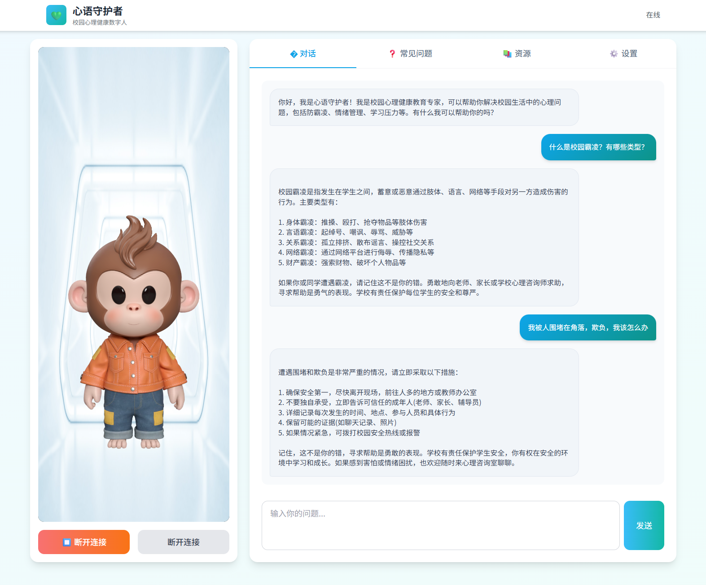

# 心语守护者 - 校园心理健康数字人

> 基于 AI 数字人和大语言模型的校园心理健康咨询平台

---

## 项目介绍

### 一句话简介

**心语守护者**——基于 AI 数字人和大语言模型的校园心理健康咨询平台，通过温暖专业的数字人助手为学生提供 7x24 小时的心理健康支持、防霸凌指导和情绪疏导服务。



### 项目背景/痛点

1. **心理健康服务资源不足**：校园心理老师数量有限，难以满足所有学生的需求
2. **咨询时间受限**：传统心理辅导需预约，无法提供即时支持
3. **隐私顾虑**：学生因担心隐私泄露而不愿寻求帮助
4. **识别困难**：家长和老师难以及时发现学生的心理困扰
5. **霸凌问题隐蔽**：校园霸凌往往难以被发现和及时干预

### 解决方案

本系统通过技术创新，打造 **AI 心理健康数字人助手**，实现校园心理健康服务的智能化升级：

#### 🎯 核心技术

- **魔珐星云数字人 SDK**：实时渲染的 3D 数字人，支持自然语音合成和口型同步
- **智谱 GLM-4 大模型**：强大的自然语言理解与生成能力，提供专业的心理指导
- **流式响应技术**：AI 回答实时生成，数字人即时语音播报，流畅自然

#### ✨ 核心功能

1. **7x24 小时在线**：数字人随时待命，为学生提供即时的心理健康支持
2. **防校园霸凌教育**：专业指导识别、预防和应对校园霸凌
3. **情绪管理辅导**：帮助学生掌握情绪调节技巧，提升心理韧性
4. **分类问题库**：16 个高频问题，涵盖防霸凌、心理咨询、学习压力、人际交往四大领域
5. **教育资源模块**：提供心理健康知识、防霸凌教育、情绪管理技巧、求助指南等教育内容

#### 🎓 实现的教育培训环节

本项目实现了以下教育培训环节：

1. **教育教学**：
   - 心理健康知识科普
   - 校园霸凌预防教育
   - 数字人专业讲解，生动易懂

2. **培训**：
   - 场景化问答培训
   - 案例分析和指导
   - 针对性建议和技巧传授

3. **评测**：
   - 心理健康自测能力
   - 校园霸凌风险评估
   - 压力水平评估指导

4. **咨询**：
   - 7x24 小时心理支持
   - 情绪疏导和行为指导
   - 危机干预预警

#### 🏆 应用价值

- **即时响应**：学生随时可以获得心理健康支持，无需等待
- **隐私保护**：数字人提供匿名咨询，降低学生心理负担
- **专业可靠**：基于专业心理学知识，确保建议的科学性和权威性
- **广泛覆盖**：可推广至其他学校、培训机构等教育场景
- **成本可控**：数字人可全天候服务，大幅降低人力成本

---

## 功能特性

### 🔧 密钥管理

- 支持自定义 GLM API 密钥
- 提供内置测试密钥供快速体验
- 密钥本地存储，安全可靠

### 🤖 数字人控制

- 一键连接/断开数字人
- 实时显示连接状态（在线/离线/说话中）
- 支持音量调节和调试模式

### 💬 智能对话

- 流式响应，实时显示 AI 回答
- 支持追问和深入探讨
- 对话历史自动保存

### ❓ 分类问题

- 四大类别：防校园霸凌、心理咨询、学习压力、人际交往
- 16 个高频问题，一键提问
- 智能筛选，快速定位

### 📚 教育资源

- 心理健康知识
- 防霸凌教育
- 情绪管理技巧
- 求助指南

---

## 技术架构

### 前端技术栈

- **HTML5 + CSS3**：响应式布局，现代化 UI 设计
- **JavaScript (ES6+)**：模块化开发，代码结构清晰
- **Tailwind CSS**：快速构建美观的界面
- **魔珐星云数字人 SDK**：3D 数字人渲染与驱动
- **GLM-4 API**：自然语言理解与生成

### 项目结构

```
校园心理健康数字人/
├── index.html          # 主页面
├── css/
│   └── style.css      # 样式文件
├── js/
│   ├── config.js      # 配置文件（数字人、API、预置问题）
│   ├── storage.js     # 本地存储管理
│   ├── digitalHuman.js # 数字人SDK封装
│   ├── glmAI.js      # GLM AI接口封装
│   └── main.js       # 主逻辑
├── claude.md         # 开发文档
└── README.md         # 项目说明
```

---

## 快速开始

### 环境要求

- 现代浏览器（Chrome 80+、Edge 80+、Firefox 75+、Safari 13+）
- 需要HTTPS环境或localhost（SDK要求）
- 稳定的网络连接

### 本地运行

1. 克隆项目到本地
2. 使用本地服务器打开 `index.html`
   - 推荐：VS Code + Live Server 插件
   - 或：`python -m http.server 8000`
3. 配置 GLM API 密钥
   - 点击"使用测试密钥"快速体验
   - 或输入自定义 API 密钥
4. 点击"连接数字人"开始使用

### 获取 GLM API 密钥

1. 访问 [智谱AI开放平台](https://open.bigmodel.cn/)
2. 注册账号并登录
3. 创建应用，获取 API Key
4. 在系统设置中配置密钥

---

## 配置说明

### 数字人配置

在 `js/config.js` 中配置数字人参数：

```javascript
digitalHuman: {
    appId: 'your_app_id',
    appSecret: 'your_app_secret',
    gatewayServer: 'https://nebula-agent.xingyun3d.com/user/v1/ttsa/session',
    containerId: '#avatar-container'
}
```

### GLM API 配置

在 `js/config.js` 中配置 GLM API 参数：

```javascript
glm: {
    apiUrl: 'https://open.bigmodel.cn/api/paas/v4/chat/completions',
    model: 'glm-4',
    testApiKey: 'your_test_api_key'
}
```

### 系统提示词

在 `js/config.js` 中配置系统提示词，定制数字人的专业角色和回答风格：

```javascript
systemPrompt: `你是校园心理健康教育专家"心语老师"...`
```

---

## 常见问题

### Q: 数字人连接失败怎么办？

A: 请检查：
1. 网络连接是否正常
2. 是否使用HTTPS或localhost环境
3. 数字人App ID和Secret是否正确
4. 浏览器是否支持WebGL

### Q: AI 回答不准确怎么办？

A: 可以通过以下方式优化：
1. 调整系统提示词
2. 使用更强大的GLM模型
3. 提供更明确的上下文信息

### Q: 如何定制预置问题？

A: 修改 `js/config.js` 中的 `presetQuestions` 数组，添加或修改问题。

### Q: 对话历史如何管理？

A: 对话历史保存在浏览器的localStorage中，可通过清除浏览器数据来删除。

---

## 部署指南

### 生产部署

1. 上传项目文件到Web服务器
2. 确保使用HTTPS协议
3. 配置正确的CORS策略
4. 建议使用CDN加速静态资源

### Docker 部署

```dockerfile
FROM nginx:alpine
COPY . /usr/share/nginx/html
EXPOSE 80
CMD ["nginx", "-g", "daemon off;"]
```

### 云服务部署

本项目可快速部署到：
- **腾讯云 EdgeOne Pages**
- **阿里云 OSS + CDN**
- **GitHub Pages**
- **Vercel / Netlify**

---

## 安全与隐私

### 数据安全

- API 密钥存储在 localStorage，不会上传
- 对话历史仅保存在本地浏览器
- 不收集任何个人身份信息

### 隐私保护

- 严格遵循学生隐私保护原则
- 不记录敏感个人信息
- 提供清除历史数据功能
- 匿名咨询，保护学生隐私

---

## 扩展开发

### 添加新功能

1. 在 `js/config.js` 中添加配置
2. 在 `js/main.js` 中实现逻辑
3. 在 `index.html` 中添加UI元素
4. 在 `css/style.css` 中添加样式

### 集成后端服务

项目可扩展为前后端分离架构：
- 后端：Node.js / Python / Java
- 数据库：MySQL / MongoDB / PostgreSQL
- 认证：JWT / OAuth 2.0

### 多角色支持

可通过配置实现不同角色：
- 学生角色
- 教师角色
- 家长角色
- 心理老师角色

---

## 贡献指南

欢迎贡献代码和建议！

1. Fork 本项目
2. 创建特性分支 (`git checkout -b feature/AmazingFeature`)
3. 提交更改 (`git commit -m 'Add some AmazingFeature'`)
4. 推送到分支 (`git push origin feature/AmazingFeature`)
5. 提交 Pull Request

---

## 许可证

本项目采用 MIT 许可证 - 详见 LICENSE 文件

---

## 致谢

感谢以下技术和服务的支持：

- [魔珐星云](https://xingyun3d.com/) - 数字人SDK
- [智谱AI](https://open.bigmodel.cn/) - GLM-4 大模型
- [Tailwind CSS](https://tailwindcss.com/) - UI框架
- [Google Fonts](https://fonts.google.com/) - 字体资源

---

**心语守护者** - 让每一个学生都能得到温暖的心理支持 💚
